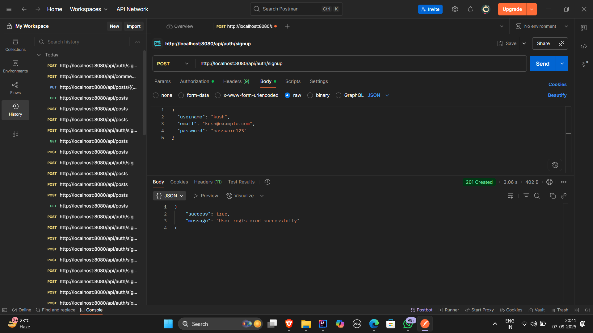
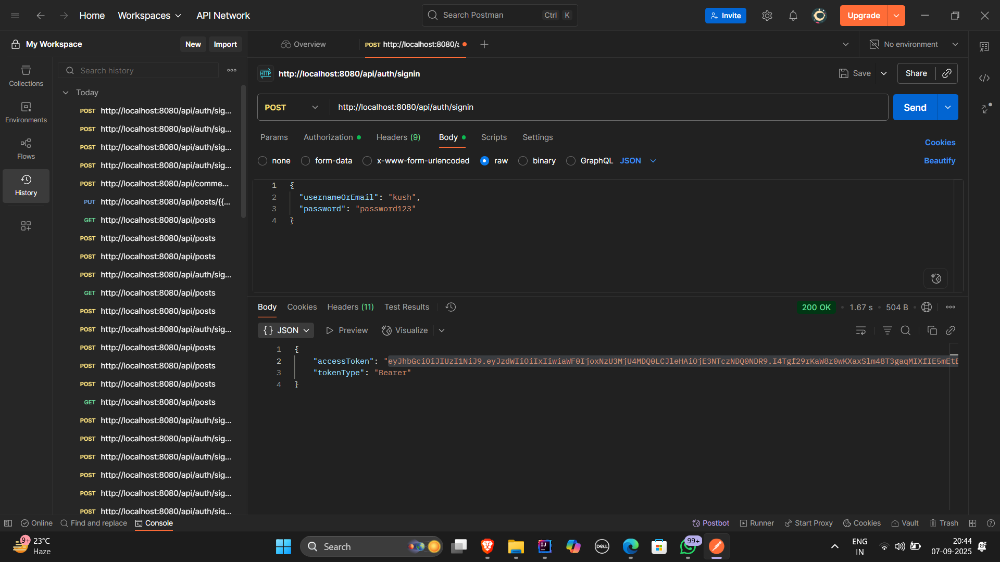
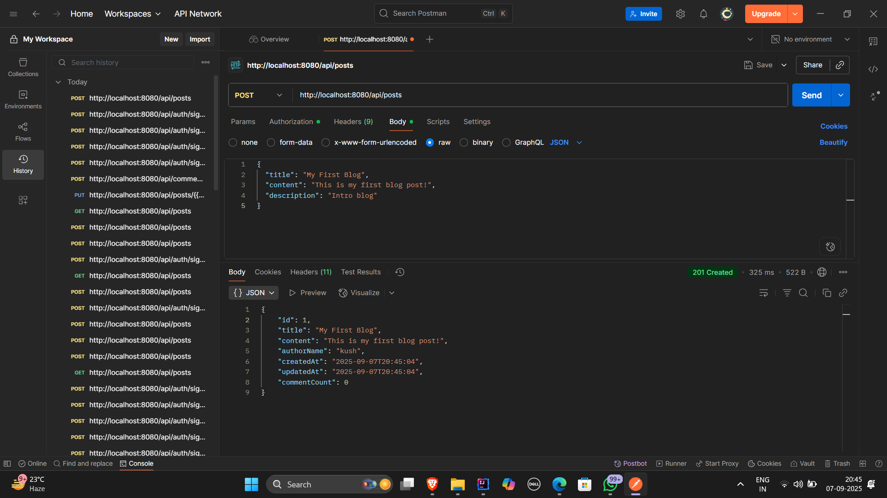
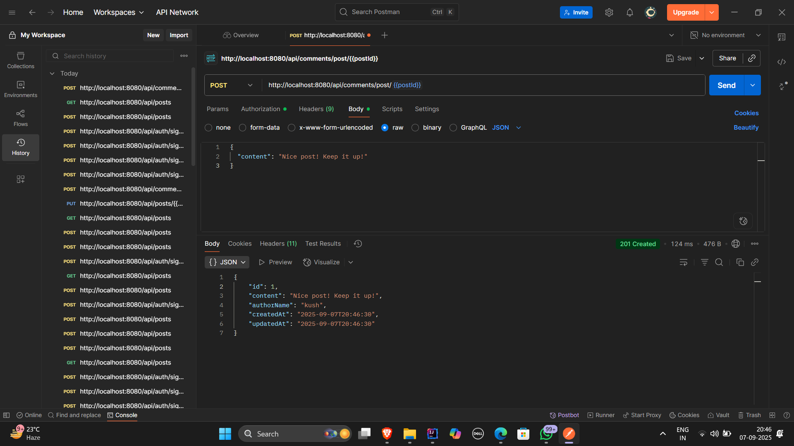
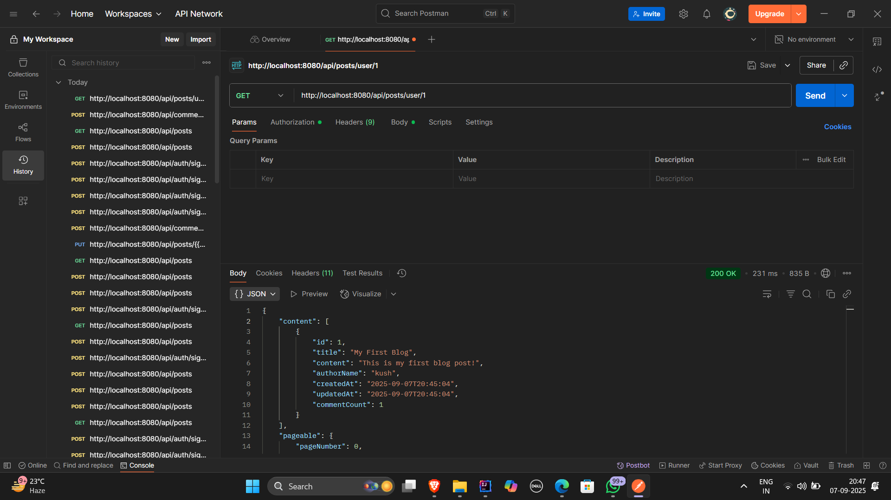

# ✍️ Blog Management System

A Spring Boot–based **Blog Management Application** that supports **user authentication with JWT**, CRUD operations for blog posts and comments, and **role-based access control**.  

This project enables users to register/login, create and interact with blog posts, and manage comments, while administrators can moderate and delete posts/comments.  
It uses **Spring Boot** with integrated dependencies such as **Spring Web**, **Spring Data JPA**, **Spring Security with JWT**, and a relational database (**MySQL**).  
API endpoints were tested using **Postman**.

---

## 🔑 Key Functionalities

- **User Authentication & Authorization**
  - Secure signup and login using JWT
  - Role-based access (User / Admin)
  - Password hashing with BCrypt  

- **Blog Posts**
  - Create new blog posts
  - Read posts with pagination & sorting
  - Update existing posts
  - Delete posts (restricted to Admin or Author)  

- **Comments**
  - Add comments to posts
  - Update or delete comments
  - Fetch comments for a given post  

---

## 🏗️ Entities

### User Entity
- Stores user information including username, email, role, and encrypted password.  
- Connected with posts and comments.  

### Post Entity
- Represents blog posts with fields like title, content, author, timestamps.  
- One-to-Many relationship with comments.  

### Comment Entity
- Stores comments made by users on posts.  
- Many-to-One relationship with posts and users.  

---

## 🌐 API Endpoints

### Authentication
- `POST /api/auth/signup` → Register a new user  
- `POST /api/auth/signin` → Authenticate user and return JWT token  

### Posts
- `GET /api/posts` → Fetch all posts (paginated)  
- `GET /api/posts/{id}` → Fetch a single post by ID  
- `POST /api/posts` → Create new post (requires authentication)  
- `PUT /api/posts/{id}` → Update existing post (author only)  
- `DELETE /api/posts/{id}` → Delete post (admin or author)  

### Comments
- `POST /api/comments/post/{postId}` → Add comment to a post  
- `GET /api/comments/post/{postId}` → Fetch all comments for a post  
- `PUT /api/comments/{id}` → Update a comment (author only)  
- `DELETE /api/comments/{id}` → Delete comment (admin or author)  

---

## 📬 Example API Calls (Postman)

1. **Signup**
   - `POST http://localhost:8080/api/auth/signup`  
   - Request Body:
     ```json
     {
       "username": "john_doe",
       "email": "john@example.com",
       "password": "password123"
     }
     ```

2. **Signin**
   - `POST http://localhost:8080/api/auth/signin`  
   - Response:
     ```json
     {
       "accessToken": "jwt-token-string"
     }
     ```

3. **Create Post**
   - `POST http://localhost:8080/api/posts`  
   - Headers: `Authorization: Bearer <jwt-token>`  
   - Request Body:
     ```json
     {
       "title": "My First Blog Post",
       "content": "This is the content of the blog post"
     }
     ```

---
⚙️ Setup Instructions
1️⃣ Clone the Repository
git clone https://github.com/kushsengar/Blog-Management-System.git
cd Blog-Management-System
## 🖼️ Postman Screenshots
## Screenshots

### 1. User Signup


### 2. User Signin


### 3. Create a Post


### 4. Get Posts


### 5. Add Comment


### 6. Get Post by ID



